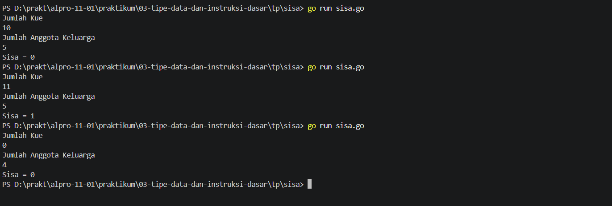
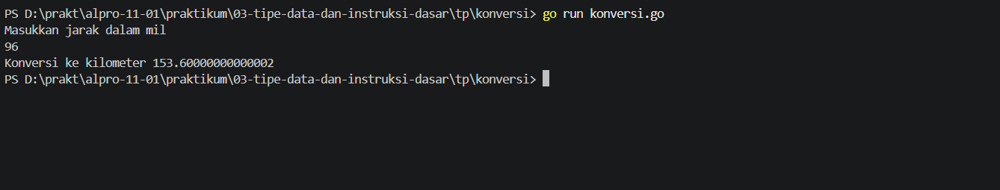
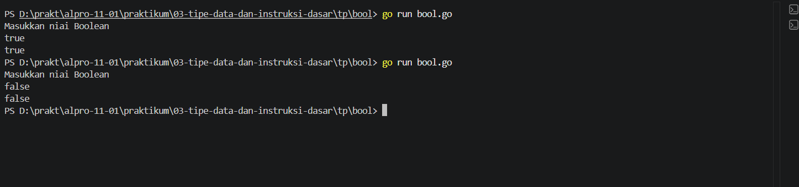

# <h1 align="center">Tugas Pendahuluan Modul 03 - Variabel dan Operator Bahasa Pemrograman Go</h1>
<p align="center">Zeda Briyan Dinillah - 109092600014</p>

### 1. Sisa Kue

```go
package main

import "fmt"

func main() {
	
	var x, y int
	fmt.Println("Jumlah Kue")
	fmt.Scan(&y)
	fmt.Println("Jumlah Anggota Keluarga")
	fmt.Scan(&x)

	modulo := y % x

	fmt.Printf("Sisa = %d", modulo)
}
```

##### Output



#### Deskripsi
Program untuk menghitung sisa kue setelah dibagikan secara sama rata kepada anggota keluarga.

### 2. Konversi

```go
package main

import "fmt"

func main() {
	var x float64

	fmt.Println("Masukkan jarak dalam mil")
	fmt.Scan(&x)

	kilometer := x * 1.6

	fmt.Println("Konversi ke kilometer", kilometer)
}
```

##### Output


#### Deskripsi
Program untuk mengubah jarak dalam mil kedalam jarak dalam kilometer. 

### 3. Boolean

```go
package main

import "fmt"

func main() {
	var bool bool

	fmt.Println("Masukkan niai Boolean")
	fmt.Scan(&bool)

	fmt.Println(bool)
}
```

##### Output



#### Deskripsi
Program untuk membaca dan mencetak nilai bertipe _boolean_

## Kesimpulan
Kesimpulan dari tugas pendahuluan ini yaitu penerapan tipe data, variabel, dan operator matematika menjadi sebuah program berbahasa Go.