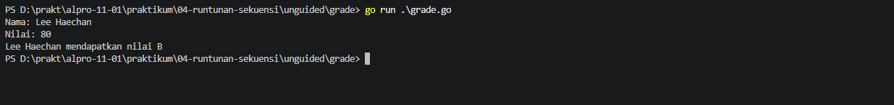
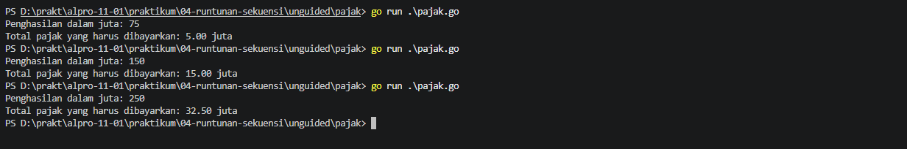

# <h1 align="center">Laporan Praktikum Modul 04 - Runtunan dan Sekuensi</h1>
<p align="center">Zeda Briyan Dinillah - 109092600014</p>

## Dasar Teori

### A. 

#### 1. 


#### 2. 


### B. 


## Guided

### 1. Nama File: grade.go

```go
package main

import (
	"bufio"
	"os"
	
	"fmt"
)

func main() {
	var nama string
	var nilai float64
	var grade string

	scanner := bufio.NewScanner(os.Stdin)
	scanner.Scan()

	nama = scanner.Text()

	fmt.Scanln(&nilai)

	if nilai >= 90 && nilai <= 100 {
		grade = "A"
	} else if nilai >= 80 && nilai < 90 {
		grade = "B"
	} else if nilai >= 70 && nilai < 80 {
		grade = "C"
	} else if nilai >= 60 && nilai < 70 {
		grade = "D"
	} else {
		grade = "F"
	}

	fmt.Printf("%s mendapatkan nilai %s\n", nama, grade)

}
```
#### Deskripsi
Membuat program yang mampu mengklasifikasikan nilai seorang siswa, kemudian mencetak nama beserta _grade_ yang diperoleh dalam bentuk huruf, dari A-F.

### 2. Nama File: klasifikasi.go

```go
package main

import (
	"fmt" 
)

func main() {
	var usia int
	var gaji int
	var keterangan string

	fmt.Scan(&usia)
	fmt.Scan(&gaji)

	switch {
	case usia < 18:
		keterangan = "Masih sekolah"
	case usia >= 18 && usia <= 25 && gaji >= 50:
		keterangan = "Muda sukses"
	case usia >= 18 && usia <= 25 && gaji < 50:
keterangan = "Masih belajar hidup"
	case usia >= 26 && usia <= 40 && gaji >= 100:
		keterangan = "Pekerja mapan"
	case usia >= 26 && usia <= 40 && gaji < 100:
		keterangan = "Perlu perbaikan karier"
	case usia > 40 && gaji >= 150:
		keterangan = "Profesional berpengalaman"
	case usia > 40 && gaji < 150:
		keterangan = "Perlu evaluasi finansial"
	}

	fmt.Println(keterangan)
}
```
#### Deskripsi
Membuat program yang mengklasifikasikan seseorang berdasarkan usia dan status keuangannya (dengan gaji tahunan). 

### 3. Nama File: penilaian.go

```go
package main

import (
	"bufio"
	"fmt"
	"os"
)

func main() {
	var pilihan int
	var nama string
	var nilai float64
	var grade string

	fmt.Println("============= Menu =============")
	fmt.Println("1. Sistem penilaian")
	fmt.Println("0. Keluar")
	fmt.Print("Pilih opsi: ")

	fmt.Scanln(&pilihan)

	if pilihan == 1 {
		fmt.Print("Masukkan nama siswa: ")

		scanner := bufio.NewScanner(os.Stdin)

		scanner.Scan()

		nama = scanner.Text()

		fmt.Print("Masukkan nilai siswa: ")
		fmt.Scanln(&nilai)

		if nilai >= 90 && nilai <= 100 {
			grade = "A"
		} else if nilai >= 80 && nilai < 90 {
			grade = "B"
		} else if nilai >= 70 && nilai < 80 {
			grade = "C"
		} else if nilai >= 60 && nilai < 70 {
			grade = "D"
		} else {
			grade = "F"
		}

		fmt.Printf("%s mendapatkan nilai %s\n", nama, grade)

	} else if pilihan == 0 {
		fmt.Println("Keluar dari program.")

	} else {
		fmt.Println("Pilihan tidak valid.")
	}
}
```
#### Deskripsi
Membuat program yang memiliki menu sederhana. Menu pertama untuk masuk ke sistem penilaian yang diawali dengan _input_ nama dan nilai siswa, yang kemudian mencetak nama siswa beserta dengan nilai dalam bentuk huruf dari A-F.

## Unguided

### 1. Grade

```go
package main

import (
	"bufio"
	"os"
	"fmt"
)

func main() {
	var nama string
	var nilai float64
	var grade string

	fmt.Print("Nama: ")
	scanner := bufio.NewScanner(os.Stdin)
	scanner.Scan()

	nama = scanner.Text()
	
	fmt.Print("Nilai: ")
	fmt.Scanln(&nilai)

	switch {
	case nilai >= 90 && nilai <= 100:
		grade = "A"
	case nilai >= 80 && nilai < 90:
		grade = "B"
	case nilai >= 70 && nilai < 80:
		grade = "C"
	case nilai >= 60 && nilai < 70:
		grade = "D"
	default:
		grade = "F"
	}

	fmt.Printf("%s mendapatkan nilai %s\n", nama, grade)
}
```

##### Output



#### Deskripsi
Membuat program yang secara fungsi sama dengan program _guided_ grade.go, akan tetapi, program ini menggunakan _statement_ `switch`, berbeda dengan program _guided_ grade.go yang menggunakan _statement_ `if`.


### 2. Pajak

```go
package main

import "fmt"

func main() {
	var penghasilan float64
	var pajak float64

	fmt.Print("Penghasilan dalam juta: ")
	fmt.Scan(&penghasilan)

	if penghasilan <= 50 && penghasilan >= 0 {
		pajak = 0.05 * float64 (penghasilan)
	} else if penghasilan > 50 && penghasilan < 100 {
		pajak = (0.05 * 50) + (0.10 * float64 (penghasilan-50))
	} else if penghasilan >= 100 && penghasilan < 200 {
		pajak = (0.05 * 50) + (0.10 * 50) + (0.15 * float64 (penghasilan-100))
	} else if penghasilan >= 200 {
		pajak = (0.05 * 50) + (0.10 * 50) + (0.15 * 100) + (0.20 * float64 (penghasilan-200))
	}

	fmt.Printf("Total pajak yang harus dibayarkan: %.2f juta", pajak)
}
```

##### Output


#### Deskripsi
Membuat program yang menghitung total pajak penghasilan seseorang berdasarkan dari total penghasilannya. Kemudian, penghasilan digolongkan menjadi:
|No | Penghasilan (Juta)| Komponen Pajak |Persentase|
|:-:|	:---:		| :---			 | :---:	|	
|1.	|	≤ 50 		|	Seluruh penghasilan	|		5%	|
|2.	|	> 50 – 100	|	50 juta pertama	 |		5%	|
|	|				|	Sisa penghasilan diatas 50 juta		 |		10%	|
|3.	|	> 100 – 200	|	50 juta pertama			 |		5%	|
|	|				|	50 juta berikutnya (50-100) |	10%		|				|
|	|				|	Sisa penghasilan diatas 100 juta			 |	15%		|				|
|4.	|	> 200		|	50 juta pertama			 |		5%	|
|	|				|	50 juta berikutnya (50-100)|	10%
|	|				|	100 juta berikutnya (100-200) |		15%
|	|				|	Sisa penghasilan diatas 200 juta|	20%

Setelah menghitung total pajak, program kemudian memberikan keluaran berupa total pajak yang harus dibayarkan.

## Kesimpulan


## Referensi
1. Go Team. (2026). _The Go Programming Language Specification_. Google LLC. Diakses pada 04 Oktober 2026 melalui https://go.dev/ref/spec.