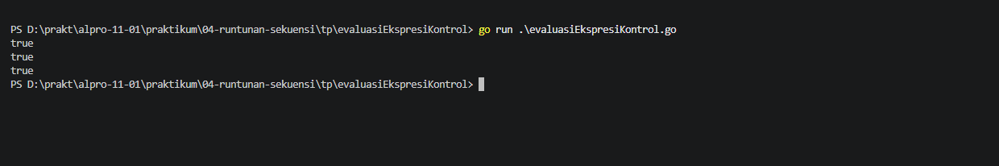
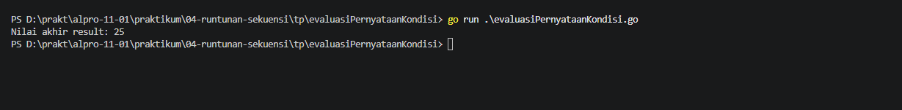
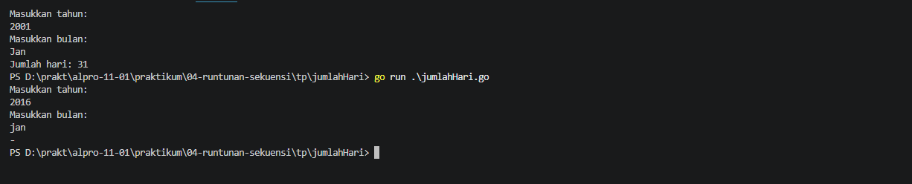
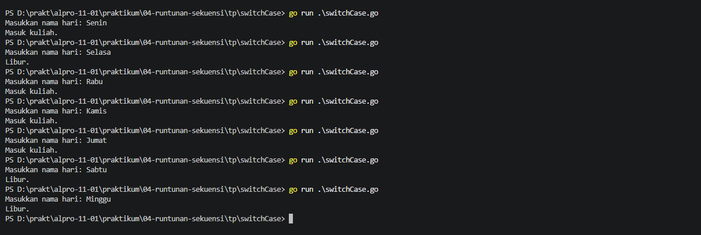

# <h1 align="center">Tugas Pendahuluan Modul 04 - Runtunan dan Sekuensi</h1>
<p align="center">Zeda Briyan Dinillah - 109092600014</p>

### 1. Evaluasi Ekspresi Kontrol dalam Go

```go
package main

import "fmt"

func main() {
	intNum := 5
	intOther := 10
	var sngNum float64 = -3

	if intNum > 0 {
		fmt.Println(intNum > 0)
	}

	if intNum >= 5 && intOther < 11 {
		fmt.Println(intNum >= 5 && intOther < 11)
	}

	if sngNum > 0 || (intNum > 0 && -1 * intOther == -10) {
		fmt.Println(sngNum > 0 || (intNum > 0 && -1 * intOther == -10))
	}
}
```

##### Output



#### Deskripsi
Program untuk memeriksa apakah ekspresi kontrol bernilai `true` atau `false`.

### 2. Tracing: Evaluasi Pernyataan Kondisi

```go
package main

import "fmt"

func main() {
	x := 10
	y := 5
	z := 15
	result := 0

	if x > 5 {
		if y < 10 {
			result = x + y
		} else {
			result = x - y
		}
	}

	if z > 10 && x == 10 {
		result += z
	} else {
		result = z - x
	}

	if x == 10 || y > 10 {
		result += 5
	} else if y == 5 && z > 10 {
		result -= 5
	} else {
		result *= 2
	}

	if !(x < 15 && y < 10) {
		result += 10
	} else {
		result -= 10
	}

	fmt.Println("Nilai akhir result:", result)
}
```

##### Output


#### Deskripsi
Program untuk menghitung nilai akhir dari pernyataan-pernyataan kondisi.

### 3. Menentukan Jumlah Hari dalam Sebulan Berdasarkan Tahun dan Bulan

```go
package main

import "fmt"

func main() {
	var tahun int
	var bulan string

	fmt.Println("Masukkan tahun: ")
	fmt.Scan(&tahun)
	fmt.Println("Masukkan bulan: ")
	fmt.Scan(&bulan)

	kabisat := (tahun % 400 == 0) || (tahun % 4 == 0 && tahun % 100 != 0)

	switch bulan {
	case "Jan", "Mar", "Mei", "Jul", "Agu", "Okt", "Des":
		fmt.Println("Jumlah hari: 31")
	case "Apr", "Jun", "Sep", "Nov":
		fmt.Println("Jumlah hari: 30")
	case "Feb":
		if kabisat {
			fmt.Println("Jumlah hari: 29")
		} else {
			fmt.Println("Jumlah hari: 28")
		}
	default:
		fmt.Println("-")
	}
}
```

##### Output



#### Deskripsi
Program untuk menentukan jumlah hari dalam satu bulan berdasarkan _input_ tahun dan bulan.

### 4. Switch Case

```go
package main

import "fmt"

func main() {
	var hari string
	fmt.Print("Masukkan nama hari: ")
	fmt.Scan(&hari)

	switch hari {
	case "Senin", "Rabu", "Kamis", "Jumat":
		fmt.Println("Masuk kuliah.")
	case "Selasa", "Sabtu", "Minggu":
		fmt.Println("Libur.")
	default:
		fmt.Println("Hari tidak valid.")
	}
}
```
#### Output



#### Deskripsi
Program untuk memeriksa apakah _input_ nama hari memiliki jadwal mata kuliah atau merupakan hari libur.

## Kesimpulan
Kesimpulan dari tugas pendahuluan yaitu penerapan _statement_ `switch`, `case`, dan `default` dalam sebuah program.